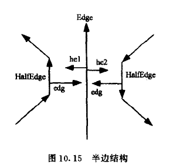
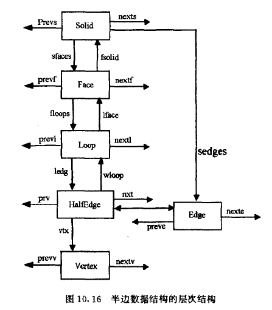

# 三维 CAD 建模 - 欧拉操作

1. 定义半边数据结构；
2. 基于半边数据结构，实现五个欧拉操作
3. 基于欧拉操作，实现扫掠操作，并将基于扫掠操作构建的实体模型进行图形显示
   1. 一定要允许多个环

## 设计思想

半边数据结构：





## 实体构造过程

平面构造 + 平移扫层。

首先构建一个具有多个孔的平面，然后在平面的基础上进行平移扫层生成一个三维物体。最后对三维物体进行绘制，绘制和交互过程使用 OpenGL 实现。

## 安装依赖

使用 macOS、Clion、VSCode 和 cmake 开发，依赖 OpenGL 和 freeglut。

```bash
brew install freeglut
```

## 使用

请参考 `main.cpp` 中的注释，运行后按照格式规范输入样例数据即可：

```txt
格式定义
    第一行：v(vertex 个数), r(内环个数)
    接下来 v 行，每一行的格式都是：r_index, x, y, z，其中 ：
            r_index 表示点所属的内环编号（0 - r - 1），如果为 -1 则表示不在内环里面
            (x, y, z) 表示点的坐标，类型为 double
    eg: 构造一个回字形中空立方体
    8 1
    -1 0 0 0
    -1 3 0 0
    -1 0 3 0
    -1 3 3 0

    0 1 1 0
    0 2 1 0
    0 1 2 0
    0 2 2 0
```

文件 [data-1-hole.txt](data-1-hole.txt) 和 [data-2-holes.txt](data-2-holes.txt) 分别给出了带有一个环和两个环的输入样例可供测试。

## 参考资料

1. [Euler Operators](https://pages.mtu.edu/~shene/COURSES/cs3621/NOTES/model/euler-op.html)
2. [A note on the modeling space of Euler operators](https://www.sciencedirect.com/science/article/abs/pii/0734189X84901294)